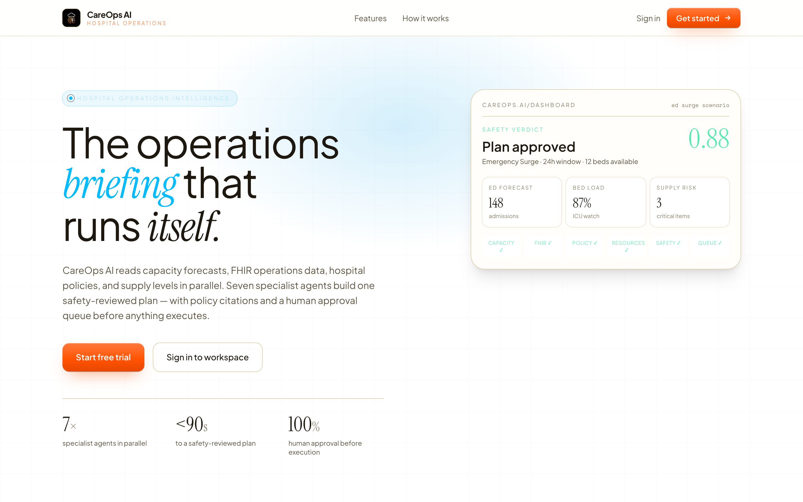
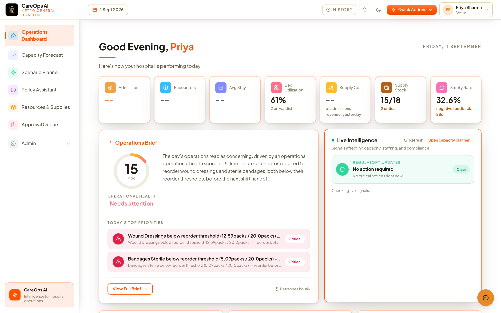
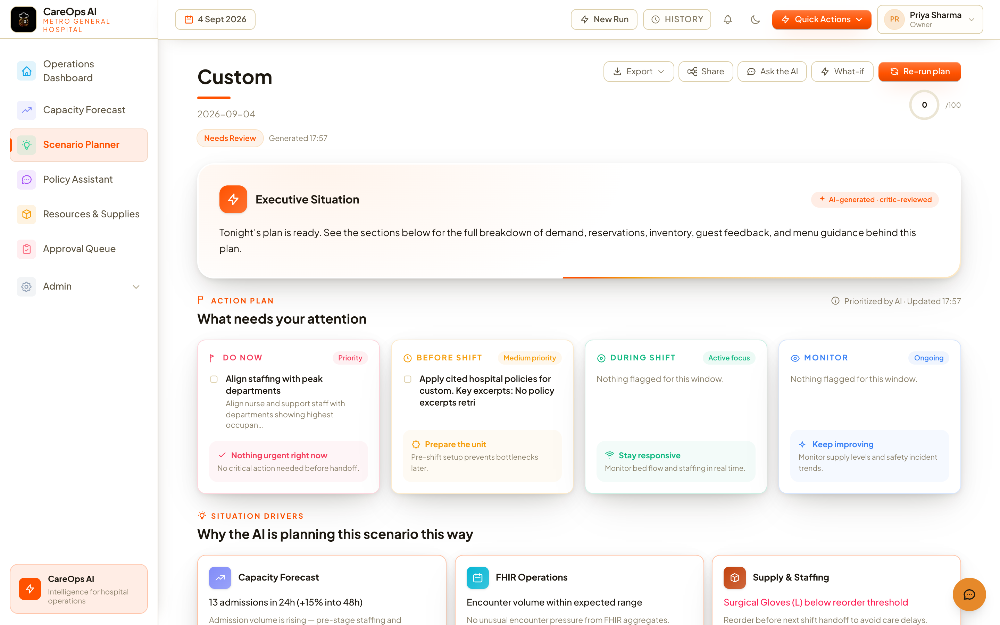
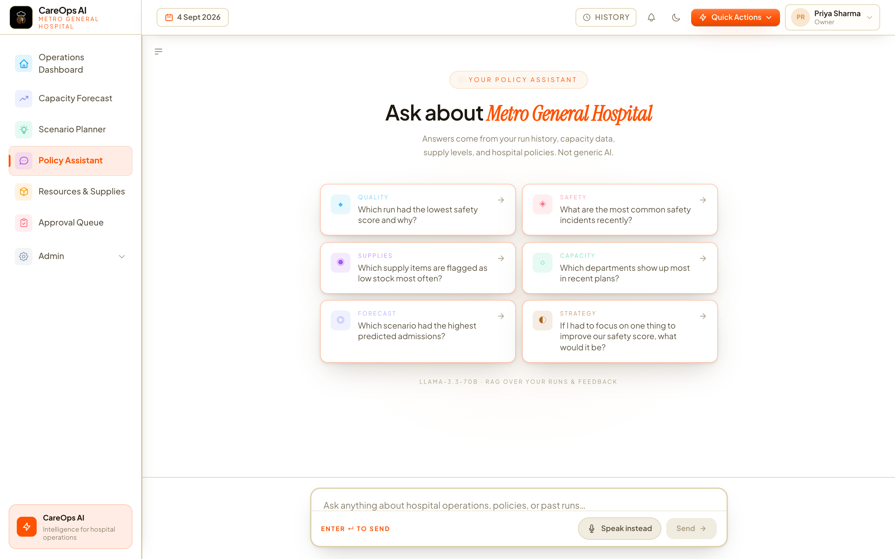
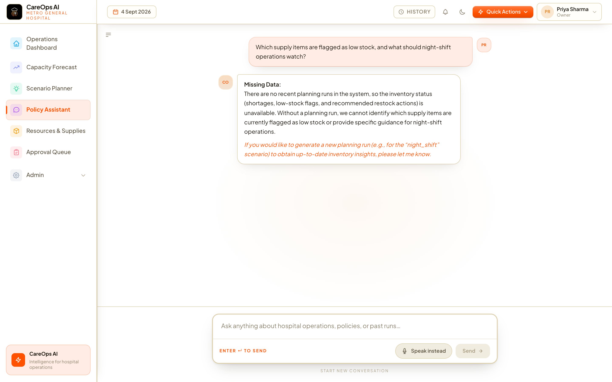
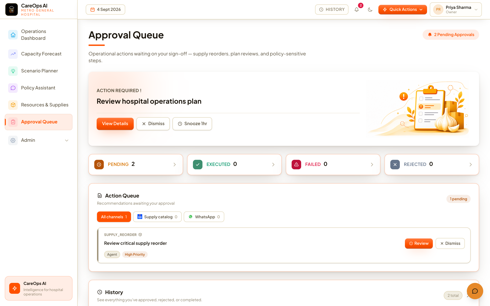
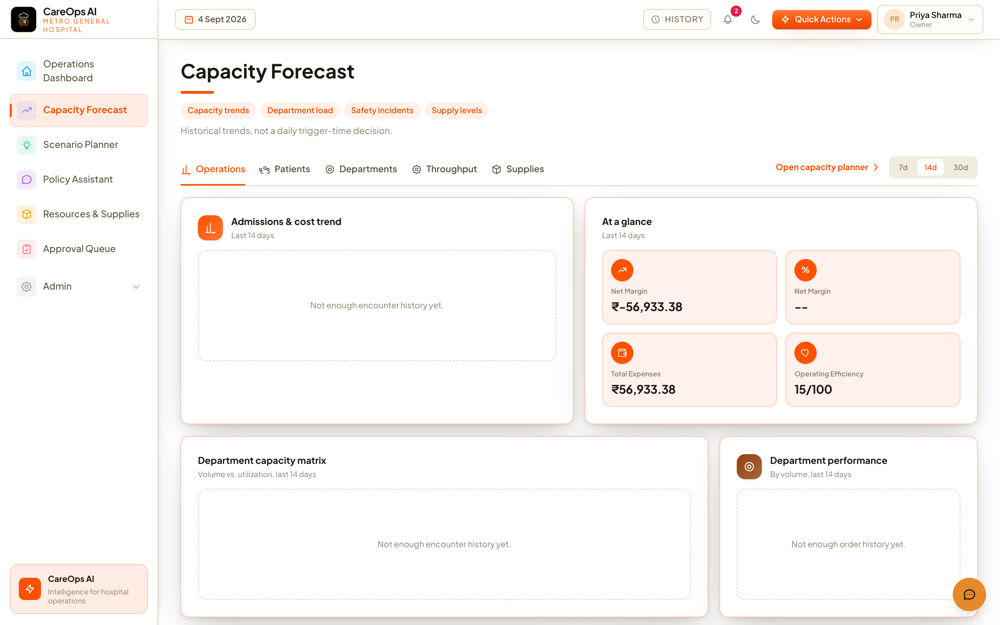
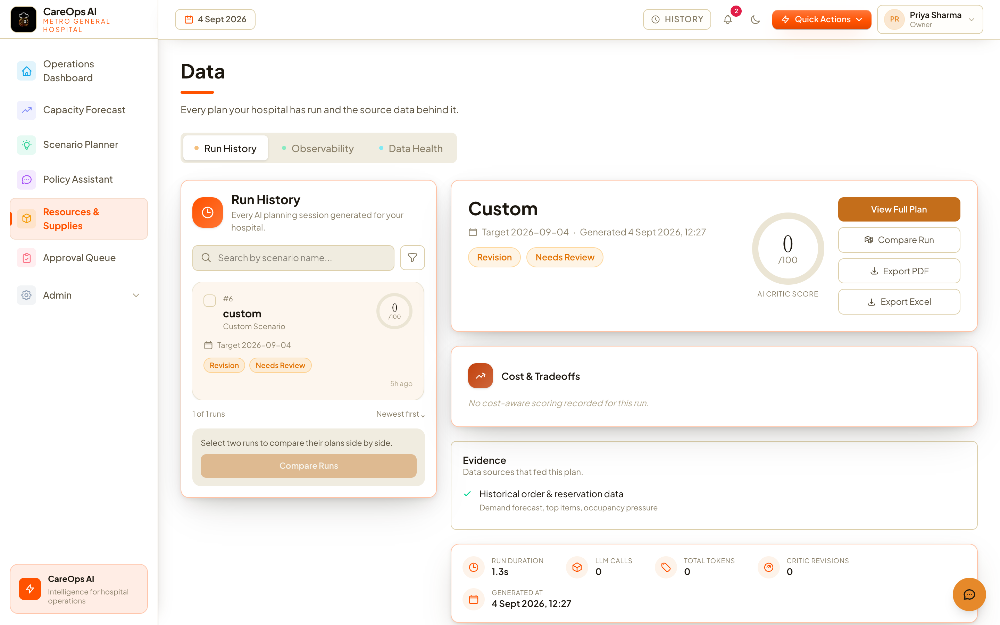
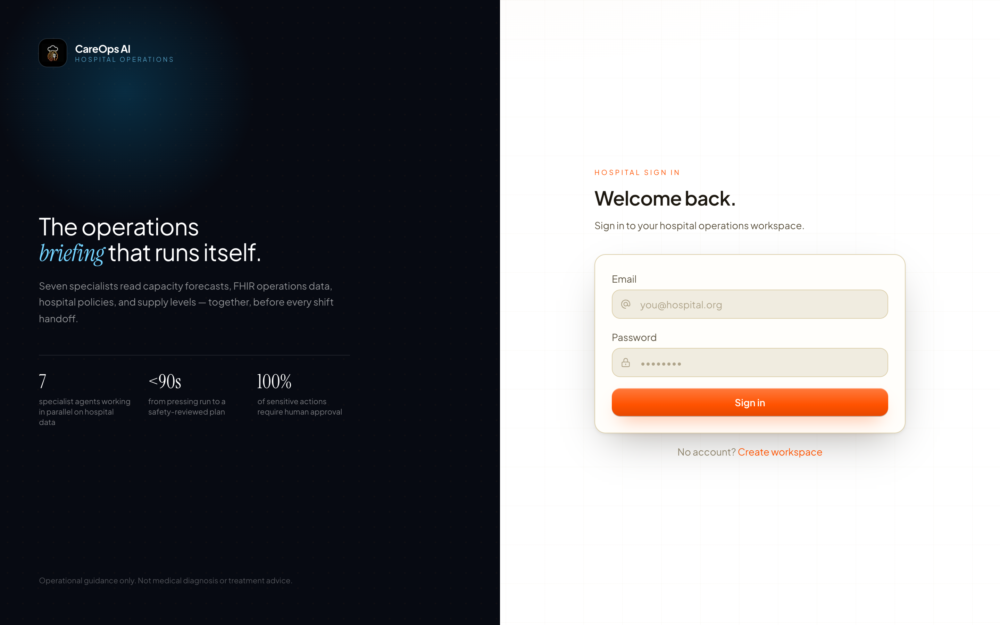

# CareOps AI

**Agentic hospital operations copilot** — seven specialist agents forecast capacity, read FHIR operations data, retrieve hospital policies with citations, and route sensitive actions through a human approval queue.

[](LICENSE)
[](apps/api)
[](apps/api)
[](apps/api/app/orchestration/careops_graph.py)
[](apps/web/careops-ui)

> Operational planning only — not diagnosis, treatment, or medication advice.  
> Demo data is synthetic and de-identified (no real PHI).

<p align="center">
  
</p>

---

## Product tour

All screens below are from a local run at `http://localhost:3000`.

### Operations dashboard

Health score, bed utilization, supply alerts, and live intelligence in one briefing.

<p align="center">
  
</p>

### Scenario planner

Seven agents build a safety-reviewed plan: capacity forecast, FHIR ops, policy RAG, resource allocation, critic, then approval queue.

<p align="center">
  
</p>

### Policy Assistant (AI chat)

Ask about capacity, supplies, safety incidents, and past runs. Answers are grounded in hospital data and policies — not generic chat.

<p align="center">
  
</p>

<p align="center">
  
</p>

### Approval queue

Low-confidence or high-impact actions wait for a human sign-off before anything executes.

<p align="center">
  
</p>

### Capacity forecast · resources · sign-in

<table>
<tr>
<td width="50%"></td>
<td width="50%"></td>
</tr>
<tr>
<td align="center">Capacity trends and department load</td>
<td align="center">Run history, critic scores, exports</td>
</tr>
</table>

<p align="center">
  
</p>

---

## What it does

| Feature | What you get |
|---------|----------------|
| **Capacity forecasting** | 24–48h admission / OPD workload from appointments and bed occupancy |
| **Policy RAG** | Hospital SOPs from Qdrant with `policy_id` citations |
| **Resource allocation** | Staffing and clinical supply coordination across departments |
| **Safety critic** | Blocks clinical-advice language; scores grounding before you see the plan |
| **Human approval queue** | Supply reorders and low-confidence actions need operator sign-off |
| **Policy Assistant** | Operator AI chat over runs, supplies, policies, and safety history |

**Scenario presets:** `ed_surge` · `opd_peak` · `icu_capacity` · `supply_shortage`

---

## Architecture

```
Next.js UI  →  FastAPI  →  LangGraph (7 agents)
                  ↓              ↓
            PostgreSQL       Qdrant (policies)
                  ↓              ↓
              Redis          Healthcare MCP (FHIR + local tools)
```

**Pipeline:** Supervisor → Capacity Forecast → parallel *(FHIR Ops · Policy RAG · Resource Allocation)* → Aggregator → Safety Critic → Human Approval Queue

More detail: [`docs/ARCHITECTURE.md`](docs/ARCHITECTURE.md) · [`docs/INTERVIEW_GUIDE.md`](docs/INTERVIEW_GUIDE.md)

---

## Quick start

**Needs:** Docker Compose · Python 3.11+ · Node.js 20.9+ · [Groq](https://console.groq.com) + [Gemini](https://aistudio.google.com) API keys

```bash
# 1. Infrastructure
docker compose up -d

# 2. Backend
cd apps/api
cp .env.example .env          # set GROQ_API_KEY, GEMINI_API_KEY
python -m venv venv && source venv/bin/activate
pip install -r requirements.txt
alembic upgrade head
python ../../scripts/seed_demo_data.py
python ../../scripts/seed_hospital_data.py
python ../../scripts/seed_qdrant_memory.py
python ../../scripts/seed_hospital_policies.py
uvicorn app.main:app --reload --port 8000

# 3. Frontend
cd ../web/careops-ui
npm install && npm run dev
```

Open **http://localhost:3000** → register a facility → **Scenario Planner** → run Emergency Surge → ask the **Policy Assistant**.

---

## Tech stack

| Layer | Tools |
|-------|--------|
| Backend | FastAPI, SQLAlchemy, Alembic |
| Agents | LangGraph, Groq / Gemini |
| RAG | Qdrant, Gemini embeddings |
| Frontend | Next.js 16, TypeScript, Tailwind CSS 4 |
| Data | PostgreSQL, Redis |
| Evals | RAGAS, DeepEval, LangSmith golden set |

---

## Layout

```
apps/api/              FastAPI + LangGraph + healthcare MCP
apps/web/careops-ui/   Operator dashboard
scripts/               Demo + hospital seed scripts
data/fhir/             Synthetic FHIR fixtures
docs/                  Architecture, API, deploy, screenshots
```

Deploy: [`docs/DEPLOY.md`](docs/DEPLOY.md) · Backend on Render · Frontend on Vercel

---

## Author

**[shubhangini67](https://github.com/shubhangini67)**

---

## License

MIT — see [LICENSE](LICENSE). Copyright (c) 2026 shubhangini67.
